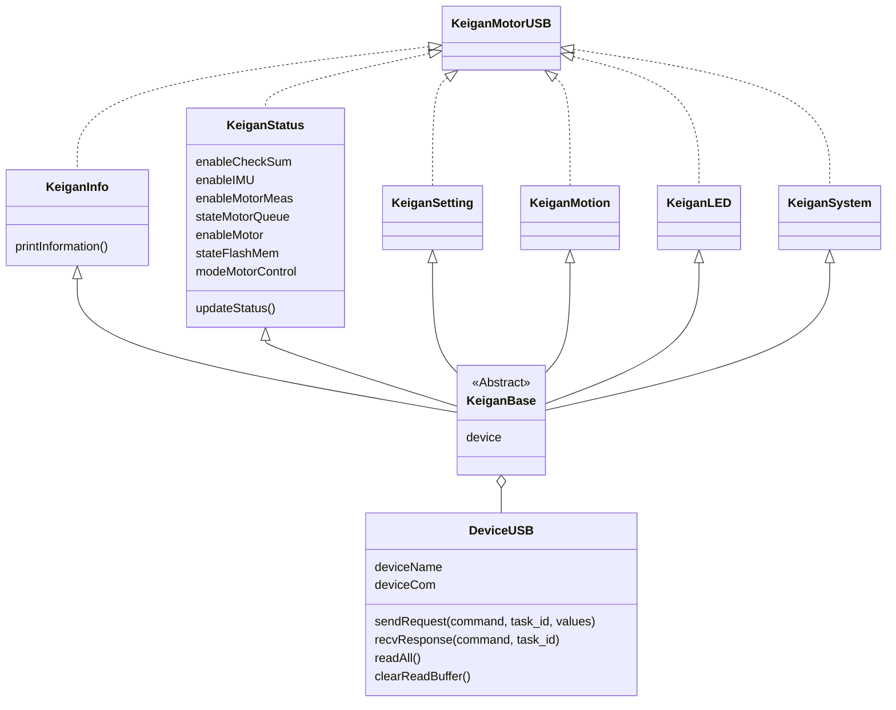

# pykeigan_usb

Keigan motor control library for connected usb

---

```mermaid
classDiagram
    class KeiganBase
        <<Abstract>> KeiganBase
        KeiganBase: device

    class DeviceUSB
        DeviceUSB
        DeviceUSB: deviceName
        DeviceUSB: deviceCom
        DeviceUSB: sendRequest(command, task_id, values)
        DeviceUSB: recvResponse(command, task_id)
        DeviceUSB: readAll()
        DeviceUSB: clearReadBuffer()

    class KeiganInfo
        KeiganInfo
        KeiganInfo: printInformation()

    class KeiganStatus
        KeiganStatus
        KeiganStatus: enableCheckSum
        KeiganStatus: enableIMU
        KeiganStatus: enableMotorMeas
        KeiganStatus: stateMotorQueue
        KeiganStatus: enableMotor
        KeiganStatus: stateFlashMem
        KeiganStatus: modeMotorControl
        KeiganStatus: updateStatus()

    KeiganMotorUSB <|.. KeiganInfo
    KeiganMotorUSB <|.. KeiganStatus
    KeiganMotorUSB <|.. KeiganSetting
    KeiganMotorUSB <|.. KeiganMotion
    KeiganMotorUSB <|.. KeiganLED
    KeiganMotorUSB <|.. KeiganSystem

    KeiganInfo <|-- KeiganBase
    KeiganStatus <|-- KeiganBase
    KeiganSetting <|-- KeiganBase
    KeiganMotion <|-- KeiganBase
    KeiganLED <|-- KeiganBase
    KeiganSystem <|-- KeiganBase

    KeiganBase o-- DeviceUSB
```

### To-Do

* [ ] CRC16 check enable
* [ ] Read buffer reset slow