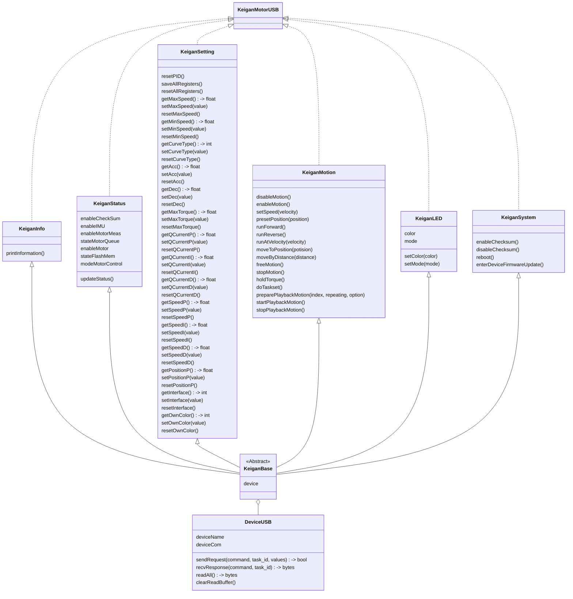

# pykeigan_usb

Keigan motor control library for connected usb

[KeiganMotor KM-1U](https://keigan-motor.com/km-1u/)


---

### examples

```python
from pykeigan_usb import KeiganMotorUSB
import time


keigan = KeiganMotorUSB(port='/dev/ttyUSB0', timeout=0.1)

keigan.enableMotion()

keigan.setSpeed(100.0)
keigan.runForward()
time.sleep(5)
keigan.stopMotion()

keigan.disableMotion()

```

### class diagram




### To-Do

* [ ] python package pip install
* [ ] CRC16 check enable
* [ ] Read buffer reset slow
* [ ] Unit Test