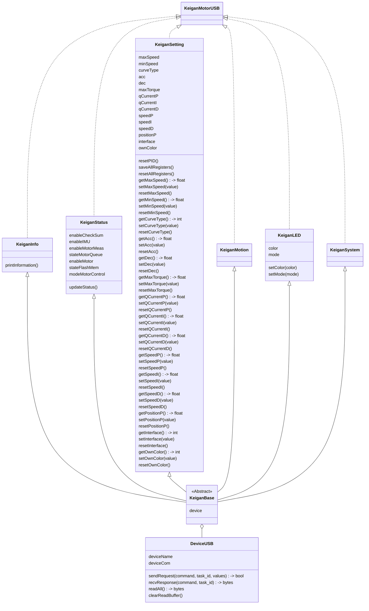

# pykeigan_usb

Keigan motor control library for connected usb

[KeiganMotor KM-1U](https://keigan-motor.com/km-1u/)

---

### To-Do

* [ ] CRC16 check enable
* [ ] Read buffer reset slow
* [ ] Unit Test